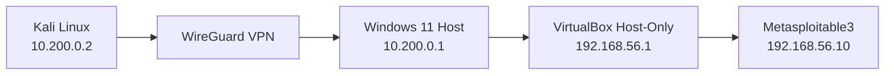

# Cybersecurity Pentest Home Lab

> Laboratório pessoal e isolado de cibersegurança para prática de redes, pentest, troubleshooting e, futuramente, Blue Team, Active Directory e detecção.

```text
┌──────────────────────────────────────────────────────────────┐
│ Projeto   : Cybersecurity Pentest Home Lab                  │
│ Status    : Ativo / Em desenvolvimento                      │
│ Foco      : Redes • Pentest • Red Team • Blue Team          │
│ Atacante  : Kali Linux físico                               │
│ Alvos     : VMs isoladas no VirtualBox                      │
└──────────────────────────────────────────────────────────────┘
```

## Sobre o projeto

Este projeto documenta a construção de um **homelab de cibersegurança isolado**, criado para permitir testes de pentest sem expor máquinas propositalmente vulneráveis diretamente à rede doméstica ou à Internet.

A máquina atacante é um **Kali Linux físico**, separado do computador que hospeda os alvos. A comunicação entre os dois computadores ocorre através de uma VPN **WireGuard**.

No computador Windows, as máquinas vulneráveis ficam em uma rede **VirtualBox Host-Only**, mantendo o ambiente de laboratório separado da LAN principal.

O primeiro alvo configurado é o **Metasploitable3**.

O objetivo de longo prazo é transformar esse ambiente em um laboratório **Purple Team**, reunindo práticas ofensivas e defensivas no mesmo ambiente controlado.

> **Uso autorizado somente.** Todos os testes documentados neste projeto devem ser realizados exclusivamente em máquinas próprias, ambientes intencionalmente vulneráveis, CTFs ou sistemas para os quais exista autorização explícita.

---

## Arquitetura atual



```text
Kali Linux              Windows 11 Host                  Rede vulnerável
10.200.0.2               10.200.0.1                      192.168.56.0/24
     │                         │                                │
     └──── WireGuard ──────────┘                                │
                               │                                │
                               └──── VirtualBox Host-Only ──────┘
                                                         192.168.56.10
                                                         Metasploitable3
```

### Plano de endereçamento

| Sistema | Interface / função | Endereço |
|---|---|---|
| Kali Linux | WireGuard | `10.200.0.2/24` |
| Windows 11 | WireGuard | `10.200.0.1/24` |
| Windows 11 | VirtualBox Host-Only | `192.168.56.1/24` |
| Metasploitable3 | `eth0` | `192.168.56.10/24` |

Redes utilizadas:

```text
WireGuard:        10.200.0.0/24
VirtualBox Lab:   192.168.56.0/24
```

---

## Por que essa arquitetura?

O objetivo principal é impedir que uma máquina intencionalmente vulnerável fique diretamente conectada à rede doméstica.

Em vez de utilizar o modo **Bridged** para os alvos vulneráveis, o laboratório utiliza uma rede **Host-Only** e um caminho de roteamento controlado:

```text
Kali
  ↓
WireGuard
  ↓
Windows 11
  ↓
Roteamento
  ↓
VirtualBox Host-Only
  ↓
VM vulnerável
```

Essa arquitetura transforma a montagem do ambiente em parte do próprio estudo, envolvendo:

- subnetting;
- interfaces virtuais;
- VPN WireGuard;
- roteamento entre redes;
- Windows IP Forwarding;
- tabelas de rota;
- rota de retorno;
- firewall;
- isolamento de máquinas vulneráveis;
- troubleshooting de rede por camadas.

Um dos principais aprendizados durante a construção foi:

> **Conseguir chegar ao destino não significa que o destino sabe responder.**

Em uma rede roteada, o caminho de retorno é tão importante quanto o caminho de ida.

---

## Componentes do laboratório

### Kali Linux

Máquina atacante física utilizada para:

- reconhecimento;
- enumeração;
- análise de serviços;
- exploração controlada;
- captura e análise de tráfego;
- testes ofensivos dentro do laboratório.

Ferramentas utilizadas ou previstas:

```text
Nmap
Metasploit Framework
Burp Suite
Gobuster
Hydra
Wireshark
tcpdump
curl
netcat
```

### Windows 11

O Windows funciona como host de virtualização e ponto intermediário entre as duas redes.

Responsabilidades:

- executar o VirtualBox;
- hospedar as VMs vulneráveis;
- terminar o túnel WireGuard;
- encaminhar tráfego entre `10.200.0.0/24` e `192.168.56.0/24`.

### VirtualBox

As máquinas vulneráveis utilizam uma rede **Host-Only**.

```text
Rede: 192.168.56.0/24
Host: 192.168.56.1
```

Isso evita colocar os alvos diretamente na LAN doméstica.

### Metasploitable3

Primeiro alvo vulnerável do laboratório.

```text
IP:        192.168.56.10/24
Interface: eth0
Rede:      VirtualBox Host-Only
```

A rota de retorno utilizada para alcançar novamente a rede WireGuard é:

```bash
sudo ip route add 10.200.0.0/24 via 192.168.56.1
```

---

## WireGuard

A rede VPN utilizada pelo laboratório é:

```text
10.200.0.0/24
```

Peers:

```text
Windows: 10.200.0.1
Kali:    10.200.0.2
```

Exemplo **sanitizado** de configuração no Kali:

```ini
[Interface]
PrivateKey = <KALI_PRIVATE_KEY>
Address = 10.200.0.2/24

[Peer]
PublicKey = <WINDOWS_PUBLIC_KEY>
Endpoint = <WINDOWS_REACHABLE_IP>:51820
AllowedIPs = 10.200.0.0/24, 192.168.56.0/24
PersistentKeepalive = 25
```

> Chaves privadas, IP público, DDNS e configurações reais não são publicados neste repositório.

---

## Status atual

| Componente | Status |
|---|:---:|
| VirtualBox Host-Only | ✅ |
| Metasploitable3 configurada | ✅ |
| Windows → Metasploitable3 | ✅ |
| WireGuard Kali ↔ Windows | ✅ |
| Handshake WireGuard | ✅ |
| Windows IP Forwarding | ✅ |
| Rota de retorno da Metasploitable3 | ✅ |
| Kali → Metasploitable3 | ✅ |
| Enumeração inicial de serviços | 🚧 |
| Segundo alvo Linux | ⏳ |
| Aplicação Web vulnerável | ⏳ |
| Alvo Windows | ⏳ |
| Active Directory | ⏳ |
| Sysmon / Wazuh | ⏳ |

**Legenda:**

```text
✅ Concluído
🚧 Em andamento
⏳ Planejado
```

---

## Validação do ambiente

### Kali → Windows via WireGuard

```bash
ping 10.200.0.1
```

### Windows → Metasploitable3

```powershell
ping 192.168.56.10
```

### Kali → Metasploitable3

```bash
ping 192.168.56.10
```

Quando os três testes funcionam, o caminho completo está operacional:

```text
Kali
 ↓
WireGuard
 ↓
Windows
 ↓
VirtualBox Host-Only
 ↓
Metasploitable3
```

---

## Enumeração inicial

Após validar a conectividade:

```bash
nmap -Pn 192.168.56.10
```

Identificação de versões:

```bash
nmap -sV -Pn 192.168.56.10
```

Enumeração padrão mais detalhada:

```bash
nmap -sC -sV -Pn 192.168.56.10
```

Nesta fase, o objetivo é identificar os serviços expostos pelo alvo e documentar a superfície de ataque do laboratório.

---

## Checklist para iniciar o laboratório

Sempre que o ambiente for utilizado:

### 1. Iniciar o host Windows

Confirme se a interface Host-Only continua configurada como:

```text
192.168.56.1/24
```

### 2. Iniciar a VM vulnerável

Na Metasploitable3:

```bash
ip addr
ip route
```

Confirme o endereço:

```text
192.168.56.10/24
```

E a rota de retorno:

```text
10.200.0.0/24 via 192.168.56.1
```

Caso a rota não esteja presente:

```bash
sudo ip route add 10.200.0.0/24 via 192.168.56.1
```

### 3. Ativar o WireGuard

No Kali:

```bash
sudo wg-quick up wg0
```

Verificar:

```bash
sudo wg
```

Procure por um `latest handshake` recente.

### 4. Testar o caminho em etapas

```bash
ping 10.200.0.1
ping 192.168.56.10
```

Somente depois desses testes o ambiente deve ser utilizado para scans e outros exercícios.

### 5. Encerrar o laboratório

No Kali:

```bash
sudo wg-quick down wg0
```

Depois:

- desligar a VM vulnerável;
- encerrar o túnel WireGuard no Windows, caso ele não precise permanecer ativo;
- manter as VMs vulneráveis fora de interfaces Bridged.

---

## Troubleshooting

### WireGuard sem handshake

Verificar:

```bash
sudo wg
```

Possíveis causas:

- chave pública associada ao peer errado;
- endpoint incorreto;
- firewall bloqueando a porta;
- túnel não iniciado no outro peer;
- IPs da VPN configurados incorretamente.

### Kali alcança o Windows, mas não a VM

Verifique:

- rota para `192.168.56.0/24` no Kali;
- `AllowedIPs` do WireGuard;
- IP Forwarding no Windows;
- firewall do Windows;
- rede Host-Only da VM.

### Windows alcança a VM, mas Kali não recebe resposta

Verifique a rota de retorno na Metasploitable3:

```bash
ip route
```

A rota esperada é:

```text
10.200.0.0/24 via 192.168.56.1
```

### Checklist rápido

```text
[ ] wg0 está ativo no Kali?
[ ] Existe latest handshake?
[ ] Kali pinga 10.200.0.1?
[ ] Windows pinga 192.168.56.10?
[ ] Kali possui rota para 192.168.56.0/24?
[ ] Windows está encaminhando pacotes?
[ ] Firewall permite o tráfego necessário?
[ ] Metasploitable possui rota para 10.200.0.0/24?
[ ] A VM está somente na rede correta?
```

---

## Roadmap

### Fase 1 — Infraestrutura de rede

- [x] Kali físico como máquina atacante
- [x] Windows como host de virtualização
- [x] VirtualBox Host-Only
- [x] Metasploitable3
- [x] IP estático
- [x] WireGuard
- [x] Handshake entre peers
- [x] IP Forwarding no Windows
- [x] Rota de retorno
- [x] Kali ↔ Metasploitable3

### Fase 2 — Linux vulnerável

- [ ] Metasploitable2 ou outro alvo Linux
- [ ] Enumeração de serviços
- [ ] Vulnerabilidades conhecidas
- [ ] Pós-exploração controlada
- [ ] Write-ups técnicos

### Fase 3 — Web Security

Possíveis ambientes:

```text
DVWA
OWASP Juice Shop
WebGoat
Aplicações vulneráveis próprias
```

Objetivos:

- autenticação;
- controle de acesso;
- SQL Injection;
- XSS;
- IDOR;
- análise com Burp Suite.

### Fase 4 — Windows

- [ ] Metasploitable3 Windows
- [ ] SMB
- [ ] RPC
- [ ] PowerShell
- [ ] enumeração de serviços Windows
- [ ] pós-exploração em ambiente autorizado

### Fase 5 — Active Directory

Topologia planejada:

```text
CORP.LOCAL
│
├── DC01
├── WS01
└── SRV01
```

Tópicos de estudo:

- Active Directory Domain Services;
- DNS;
- LDAP;
- Kerberos;
- Group Policy;
- usuários e grupos;
- enumeração de domínio;
- ataques e detecção exclusivamente no laboratório.

### Fase 6 — Blue Team

Arquitetura planejada:

```text
Endpoints
   ↓
Sysmon
   ↓
Wazuh Agent
   ↓
Wazuh / SIEM
   ↓
Dashboard e análise
```

Objetivos:

- visualizar eventos gerados pelos testes ofensivos;
- analisar logs;
- criar regras de detecção;
- correlacionar comportamento ofensivo e defensivo;
- mapear atividades ao MITRE ATT&CK.

### Fase 7 — Purple Team

Objetivo final:

```text
Ataque controlado
       ↓
Geração de telemetria
       ↓
Detecção
       ↓
Análise
       ↓
Remediação
       ↓
Documentação
```

---

## Metodologia para cada alvo

Cada nova máquina adicionada ao laboratório seguirá aproximadamente este fluxo:

```text
1. Reconhecimento
       ↓
2. Descoberta de portas
       ↓
3. Enumeração de serviços
       ↓
4. Identificação da superfície de ataque
       ↓
5. Pesquisa da vulnerabilidade
       ↓
6. Validação controlada
       ↓
7. Pós-exploração
       ↓
8. Coleta de evidências
       ↓
9. Mitigação / remediação
       ↓
10. Documentação
```

A intenção é documentar não somente **como uma vulnerabilidade pode ser explorada**, mas também:

- por que ela existe;
- qual configuração tornou o problema possível;
- qual seria o impacto;
- como detectar;
- como corrigir.

---

## Segurança ao publicar

Antes de qualquer commit público, verificar se nenhum arquivo contém:

```text
[ ] PrivateKey
[ ] PresharedKey
[ ] senha pessoal
[ ] token
[ ] IP público
[ ] DDNS privado
[ ] credencial real
[ ] arquivo .conf real com segredo
[ ] chave SSH privada
[ ] certificado privado
[ ] hostname ou caminho contendo informação pessoal
```

Exemplos publicados devem utilizar placeholders:

```text
<KALI_PRIVATE_KEY>
<KALI_PUBLIC_KEY>
<WINDOWS_PRIVATE_KEY>
<WINDOWS_PUBLIC_KEY>
<WINDOWS_REACHABLE_IP>
<VPN_ENDPOINT>
```

---

## Aviso legal

Este projeto foi criado exclusivamente para fins de:

- estudo;
- pesquisa;
- laboratório próprio;
- treinamento;
- ambientes com autorização explícita.

As técnicas documentadas não devem ser utilizadas contra sistemas ou infraestrutura de terceiros sem autorização.

---

## Autor

**Gabriel Zanoti — H1SS**

- GitHub: [@H1ssBl1tz](https://github.com/H1ssBl1tz)
- TryHackMe: [H1SS.Bl1tz](https://tryhackme.com/p/H1SS.Bl1tz)

> Building, breaking, documenting, learning.
