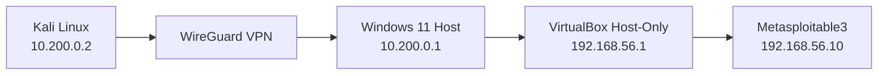

# Cybersecurity Pentest Home Lab

> An isolated, expandable cybersecurity lab built to practice networking, penetration testing, troubleshooting, and—later—Blue Team detection in a controlled environment.

```text
┌──────────────────────────────────────────────────────────┐
│ Project   : Cybersecurity Pentest Home Lab               │
│ Status    : Active / In Development                      │
│ Focus     : Networking • Pentest • Red ∩ Blue            │
│ Attacker  : Physical Kali Linux                          │
│ Targets   : Isolated VirtualBox lab                      │
└──────────────────────────────────────────────────────────┘
```

## Overview

The lab connects a **physical Kali Linux attacker machine** to vulnerable virtual machines hosted on a separate **Windows 11** computer.

The two systems communicate through **WireGuard**, while the vulnerable targets remain inside a **VirtualBox Host-Only** network instead of being exposed directly to the home LAN.

The current target is **Metasploitable3**. The environment is designed to grow into a larger lab with vulnerable Linux/Windows systems, web applications, Active Directory, Sysmon/Wazuh telemetry, and Red/Blue exercises.

> **Authorized use only.** Every test documented in this repository is intended for systems I own, intentionally vulnerable labs, CTFs, or environments where explicit authorization has been granted.

---

## Current Architecture



```text
Kali Linux              Windows 11 Host                 Vulnerable Lab
10.200.0.2               10.200.0.1                     192.168.56.0/24
     │                         │                               │
     └──── WireGuard ──────────┘                               │
                               │                               │
                               └──── VirtualBox Host-Only ─────┘
                                                        192.168.56.10
                                                        Metasploitable3
```

### Addressing

| System | Interface / Role | Address |
|---|---|---|
| Kali Linux | WireGuard | `10.200.0.2/24` |
| Windows 11 | WireGuard | `10.200.0.1/24` |
| Windows 11 | VirtualBox Host-Only | `192.168.56.1/24` |
| Metasploitable3 | `eth0` | `192.168.56.10/24` |

---

## Why This Design?

A vulnerable VM should not need direct exposure to a normal home network.

This lab deliberately separates the attacking workstation from the target network and forces traffic through a controlled routing path:

```text
Kali → WireGuard → Windows routing → Host-Only network → Target VM
```

That makes the project useful for more than exploitation practice. Building it required working with:

- subnetting and routing;
- VPN peer configuration;
- Windows IP forwarding;
- VirtualBox Host-Only networking;
- return routes;
- firewall troubleshooting;
- service enumeration;
- isolation of intentionally vulnerable systems.

One of the most useful lessons from the build was simple:

> Reaching a destination does not mean the destination knows how to reply.

The return path matters just as much as the forward path.

---

## Current Status

| Component | Status |
|---|:---:|
| VirtualBox Host-Only network | ✅ |
| Metasploitable3 static addressing | ✅ |
| Windows → Metasploitable3 | ✅ |
| WireGuard Kali ↔ Windows | ✅ |
| WireGuard handshake | ✅ |
| Windows IP forwarding | ✅ |
| Return route on Metasploitable3 | ✅ |
| Kali → Metasploitable3 | ✅ |
| Initial service enumeration | 🚧 |
| Additional Linux target | ⏳ |
| Vulnerable web target | ⏳ |
| Windows target | ⏳ |
| Active Directory lab | ⏳ |
| Sysmon / Wazuh telemetry | ⏳ |

---

## Validation

From Kali:

```bash
ping 10.200.0.1
ping 192.168.56.10
sudo wg
```

From Windows:

```powershell
ping 192.168.56.10
Get-NetIPInterface -AddressFamily IPv4 |
    Select-Object InterfaceAlias,Forwarding
```

Initial target discovery from Kali:

```bash
nmap -Pn 192.168.56.10
nmap -sV -Pn 192.168.56.10
nmap -sC -sV -Pn 192.168.56.10
```

---

## Repository Structure

```text
Cybersecurity-Pentest-Home-Lab/
│
├── README.md
├── LICENSE
├── SECURITY.md
├── CHANGELOG.md
├── .gitignore
│
├── configs/
│   ├── README.md
│   └── wireguard/
│       ├── kali-wg0.example.conf
│       └── windows.example.conf
│
├── diagrams/
│   ├── current-topology.md
│   └── future-topology.md
│
├── docs/
│   ├── 01-architecture.md
│   ├── 02-network-design.md
│   ├── 03-wireguard-setup.md
│   ├── 04-virtualbox.md
│   ├── 05-metasploitable3.md
│   ├── 06-validation.md
│   ├── 07-troubleshooting.md
│   ├── 08-roadmap.md
│   ├── 09-lab-operation-checklist.md
│   └── writeup-template.md
│
└── screenshots/
    └── README.md
```

---

## Documentation

| Document | Description |
|---|---|
| [Architecture](docs/01-architecture.md) | Current design, traffic flow, and isolation model |
| [Network Design](docs/02-network-design.md) | Addressing, routing, forwarding, and return path |
| [WireGuard Setup](docs/03-wireguard-setup.md) | Sanitized peer configuration and validation |
| [VirtualBox](docs/04-virtualbox.md) | Host-Only configuration for the target network |
| [Metasploitable3](docs/05-metasploitable3.md) | Current vulnerable target configuration |
| [Validation](docs/06-validation.md) | Connectivity and initial enumeration checks |
| [Troubleshooting](docs/07-troubleshooting.md) | Problems encountered and fixes |
| [Roadmap](docs/08-roadmap.md) | Planned expansion toward AD and Blue Team |
| [Lab Checklist](docs/09-lab-operation-checklist.md) | What to verify every time the lab is started/stopped |
| [Write-up Template](docs/writeup-template.md) | Standard format for future target documentation |

---

## Roadmap

```text
Phase 1  [DONE]  Network Infrastructure
Phase 2  [NEXT]  Vulnerable Linux Targets
Phase 3  [PLAN]  Vulnerable Web Applications
Phase 4  [PLAN]  Windows Targets
Phase 5  [PLAN]  Active Directory
Phase 6  [PLAN]  Sysmon + Wazuh / Detection
Phase 7  [PLAN]  Red Team ↔ Blue Team Exercises
```

The long-term goal is to turn this environment into a small **Purple Team lab**, where offensive activity can be generated, observed, detected, and documented from both sides.

---

## Security Notes Before Publishing

Never commit real secrets or externally reachable infrastructure information.

Keep out of Git:

```text
Private keys
Preshared keys
Passwords
Tokens
Public IP addresses
Private DDNS names
Real VPN configuration files
SSH private keys
Private certificates
```

The example configurations in this repository use placeholders only.

---

## Author

**Gabriel Zanoti / H1SS**

- GitHub: [@H1ssBl1tz](https://github.com/H1ssBl1tz)
- TryHackMe: [H1SS.Bl1tz](https://tryhackme.com/p/H1SS.Bl1tz)

> Building, breaking, documenting, learning.
