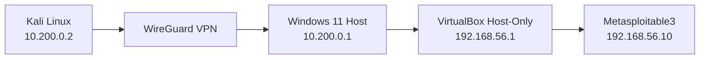

# Cybersecurity Pentest Home Lab

> Personal and isolated cybersecurity lab for practicing networking, pentesting, troubleshooting, and, in the future, Blue Team, Active Directory, and detection engineering.

```text
┌──────────────────────────────────────────────────────────────┐
│ Project   : Cybersecurity Pentest Home Lab                  │
│ Status    : Active / In Development                        │
│ Focus     : Networking • Pentest • Red Team • Blue Team    │
│ Attacker  : Physical Kali Linux machine                    │
│ Targets   : Isolated VMs in VirtualBox                     │
└──────────────────────────────────────────────────────────────┘
```

## About the project

This project documents the creation of an **isolated cybersecurity homelab**, designed to allow pentesting practice without exposing intentionally vulnerable machines directly to the home network or the Internet.

The attacking machine is a **physical Kali Linux system**, separate from the computer hosting the targets. Communication between both computers is established through a **WireGuard** VPN.

On the Windows computer, vulnerable machines are placed inside a **VirtualBox Host-Only** network, keeping the lab environment separated from the main LAN.

The first configured target is **Metasploitable3**.

The long-term goal is to turn this environment into a **Purple Team lab**, combining offensive and defensive practices inside the same controlled environment.

> **Authorized use only.** All tests documented in this project must be performed exclusively on systems you own, intentionally vulnerable environments, CTFs, or systems for which explicit authorization has been granted.

---

## Current architecture



```text
Kali Linux              Windows 11 Host                  Vulnerable Network
10.200.0.2               10.200.0.1                      192.168.56.0/24
     │                         │                                │
     └──── WireGuard ──────────┘                                │
                               │                                │
                               └──── VirtualBox Host-Only ──────┘
                                                         192.168.56.10
                                                         Metasploitable3
```

### Addressing plan

| System | Interface / Role | Address |
|---|---|---|
| Kali Linux | WireGuard | `10.200.0.2/24` |
| Windows 11 | WireGuard | `10.200.0.1/24` |
| Windows 11 | VirtualBox Host-Only | `192.168.56.1/24` |
| Metasploitable3 | `eth0` | `192.168.56.10/24` |

Networks in use:

```text
WireGuard:        10.200.0.0/24
VirtualBox Lab:   192.168.56.0/24
```

---

## Why this architecture?

The main goal is to prevent an intentionally vulnerable machine from being directly connected to the home network.

Instead of using **Bridged** mode for vulnerable targets, the lab uses a **Host-Only** network and a controlled routing path:

```text
Kali
  ↓
WireGuard
  ↓
Windows 11
  ↓
Routing
  ↓
VirtualBox Host-Only
  ↓
Vulnerable VM
```

This architecture makes the environment setup part of the learning process itself, covering topics such as:

- subnetting;
- virtual interfaces;
- WireGuard VPN;
- routing between networks;
- Windows IP Forwarding;
- routing tables;
- return routes;
- firewall configuration;
- isolation of vulnerable machines;
- layer-by-layer network troubleshooting.

One of the main lessons learned while building the environment was:

> **Being able to reach the destination does not mean the destination knows how to reply.**

In a routed network, the return path is just as important as the forward path.

---

## Lab components

### Kali Linux

Physical attacking machine used for:

- reconnaissance;
- enumeration;
- service analysis;
- controlled exploitation;
- traffic capture and analysis;
- offensive testing inside the lab.

Tools used or planned:

```text
Nmap
Metasploit Framework
Burp Suite
Gobuster
Hydra
Wireshark
tcpdump
curl
netcat
```

### Windows 11

Windows acts as both the virtualization host and the intermediary point between the two networks.

Responsibilities:

- run VirtualBox;
- host vulnerable VMs;
- terminate the WireGuard tunnel;
- forward traffic between `10.200.0.0/24` and `192.168.56.0/24`.

### VirtualBox

Vulnerable machines use a **Host-Only** network.

```text
Network: 192.168.56.0/24
Host:    192.168.56.1
```

This prevents the targets from being directly exposed to the home LAN.

### Metasploitable3

First vulnerable target in the lab.

```text
IP:        192.168.56.10/24
Interface: eth0
Network:   VirtualBox Host-Only
```

The return route used to reach the WireGuard network is:

```bash
sudo ip route add 10.200.0.0/24 via 192.168.56.1
```

---

## WireGuard

The VPN network used by the lab is:

```text
10.200.0.0/24
```

Peers:

```text
Windows: 10.200.0.1
Kali:    10.200.0.2
```

**Sanitized** example of the Kali configuration:

```ini
[Interface]
PrivateKey = <KALI_PRIVATE_KEY>
Address = 10.200.0.2/24

[Peer]
PublicKey = <WINDOWS_PUBLIC_KEY>
Endpoint = <WINDOWS_REACHABLE_IP>:51820
AllowedIPs = 10.200.0.0/24, 192.168.56.0/24
PersistentKeepalive = 25
```

> Private keys, public IP addresses, DDNS values, and real configurations are not published in this repository.

---

## Current status

| Component | Status |
|---|:---:|
| VirtualBox Host-Only | ✅ |
| Metasploitable3 configured | ✅ |
| Windows → Metasploitable3 | ✅ |
| WireGuard Kali ↔ Windows | ✅ |
| WireGuard handshake | ✅ |
| Windows IP Forwarding | ✅ |
| Metasploitable3 return route | ✅ |
| Kali → Metasploitable3 | ✅ |
| Initial service enumeration | 🚧 |
| Second Linux target | ⏳ |
| Vulnerable web application | ⏳ |
| Windows target | ⏳ |
| Active Directory | ⏳ |
| Sysmon / Wazuh | ⏳ |

**Legend:**

```text
✅ Completed
🚧 In Progress
⏳ Planned
```

---

## Environment validation

### Kali → Windows via WireGuard

```bash
ping 10.200.0.1
```

### Windows → Metasploitable3

```powershell
ping 192.168.56.10
```

### Kali → Metasploitable3

```bash
ping 192.168.56.10
```

When all three tests succeed, the complete path is operational:

```text
Kali
 ↓
WireGuard
 ↓
Windows
 ↓
VirtualBox Host-Only
 ↓
Metasploitable3
```

---

## Initial enumeration

After validating connectivity:

```bash
nmap -Pn 192.168.56.10
```

Version detection:

```bash
nmap -sV -Pn 192.168.56.10
```

More detailed default enumeration:

```bash
nmap -sC -sV -Pn 192.168.56.10
```

At this stage, the goal is to identify exposed services and document the lab target's attack surface.

---

## Lab startup checklist

Whenever the environment is used:

### 1. Start the Windows host

Confirm that the Host-Only interface is still configured as:

```text
192.168.56.1/24
```

### 2. Start the vulnerable VM

On Metasploitable3:

```bash
ip addr
ip route
```

Confirm the address:

```text
192.168.56.10/24
```

And the return route:

```text
10.200.0.0/24 via 192.168.56.1
```

If the route is missing:

```bash
sudo ip route add 10.200.0.0/24 via 192.168.56.1
```

### 3. Enable WireGuard

On Kali:

```bash
sudo wg-quick up wg0
```

Verify:

```bash
sudo wg
```

Look for a recent `latest handshake` entry.

### 4. Test the path step by step

```bash
ping 10.200.0.1
ping 192.168.56.10
```

Only after these tests succeed should the environment be used for scans and other exercises.

### 5. Shut down the lab

On Kali:

```bash
sudo wg-quick down wg0
```

Then:

- shut down the vulnerable VM;
- disable the WireGuard tunnel on Windows if it does not need to remain active;
- keep vulnerable VMs away from Bridged interfaces.

---

## Troubleshooting

### WireGuard has no handshake

Check:

```bash
sudo wg
```

Possible causes:

- public key associated with the wrong peer;
- incorrect endpoint;
- firewall blocking the port;
- tunnel not started on the other peer;
- VPN IP addresses configured incorrectly.

### Kali can reach Windows, but not the VM

Check:

- the route to `192.168.56.0/24` on Kali;
- WireGuard `AllowedIPs`;
- IP Forwarding on Windows;
- Windows Firewall;
- the VM's Host-Only network.

### Windows can reach the VM, but Kali receives no reply

Check the return route on Metasploitable3:

```bash
ip route
```

The expected route is:

```text
10.200.0.0/24 via 192.168.56.1
```

### Quick checklist

```text
[ ] Is wg0 active on Kali?
[ ] Is there a latest handshake?
[ ] Can Kali ping 10.200.0.1?
[ ] Can Windows ping 192.168.56.10?
[ ] Does Kali have a route to 192.168.56.0/24?
[ ] Is Windows forwarding packets?
[ ] Does the firewall allow the required traffic?
[ ] Does Metasploitable have a route to 10.200.0.0/24?
[ ] Is the VM connected only to the correct network?
```

---

## Roadmap

### Phase 1 — Network infrastructure

- [x] Physical Kali machine as attacker
- [x] Windows as virtualization host
- [x] VirtualBox Host-Only
- [x] Metasploitable3
- [x] Static IP addressing
- [x] WireGuard
- [x] Peer handshake
- [x] Windows IP Forwarding
- [x] Return route
- [x] Kali ↔ Metasploitable3

### Phase 2 — Vulnerable Linux

- [ ] Metasploitable2 or another Linux target
- [ ] Service enumeration
- [ ] Known vulnerabilities
- [ ] Controlled post-exploitation
- [ ] Technical write-ups

### Phase 3 — Web Security

Possible environments:

```text
DVWA
OWASP Juice Shop
WebGoat
Custom vulnerable applications
```

Goals:

- authentication;
- access control;
- SQL Injection;
- XSS;
- IDOR;
- Burp Suite analysis.

### Phase 4 — Windows

- [ ] Metasploitable3 Windows
- [ ] SMB
- [ ] RPC
- [ ] PowerShell
- [ ] Windows service enumeration
- [ ] post-exploitation in an authorized environment

### Phase 5 — Active Directory

Planned topology:

```text
CORP.LOCAL
│
├── DC01
├── WS01
└── SRV01
```

Topics to study:

- Active Directory Domain Services;
- DNS;
- LDAP;
- Kerberos;
- Group Policy;
- users and groups;
- domain enumeration;
- attacks and detection exclusively inside the lab.

### Phase 6 — Blue Team

Planned architecture:

```text
Endpoints
   ↓
Sysmon
   ↓
Wazuh Agent
   ↓
Wazuh / SIEM
   ↓
Dashboard and analysis
```

Goals:

- observe events generated by offensive tests;
- analyze logs;
- create detection rules;
- correlate offensive and defensive behavior;
- map activities to MITRE ATT&CK.

### Phase 7 — Purple Team

Final goal:

```text
Controlled attack
       ↓
Telemetry generation
       ↓
Detection
       ↓
Analysis
       ↓
Remediation
       ↓
Documentation
```

---

## Methodology for each target

Each new machine added to the lab will approximately follow this workflow:

```text
1. Reconnaissance
       ↓
2. Port discovery
       ↓
3. Service enumeration
       ↓
4. Attack surface identification
       ↓
5. Vulnerability research
       ↓
6. Controlled validation
       ↓
7. Post-exploitation
       ↓
8. Evidence collection
       ↓
9. Mitigation / remediation
       ↓
10. Documentation
```

The goal is to document not only **how a vulnerability can be exploited**, but also:

- why it exists;
- which configuration made it possible;
- what the impact would be;
- how to detect it;
- how to fix it.

---

## Publication security

Before any public commit, verify that no file contains:

```text
[ ] PrivateKey
[ ] PresharedKey
[ ] personal password
[ ] token
[ ] public IP address
[ ] private DDNS
[ ] real credentials
[ ] real .conf file containing secrets
[ ] private SSH key
[ ] private certificate
[ ] hostname or path containing personal information
```

Published examples should use placeholders:

```text
<KALI_PRIVATE_KEY>
<KALI_PUBLIC_KEY>
<WINDOWS_PRIVATE_KEY>
<WINDOWS_PUBLIC_KEY>
<WINDOWS_REACHABLE_IP>
<VPN_ENDPOINT>
```

---

## Legal notice

This project was created exclusively for:

- study;
- research;
- personal lab use;
- training;
- environments with explicit authorization.

The techniques documented here must not be used against third-party systems or infrastructure without authorization.

---

## Author

**Gabriel Zanoti — H1SS**

- GitHub: [@H1ssBl1tz](https://github.com/H1ssBl1tz)
- TryHackMe: [H1SS.Bl1tz](https://tryhackme.com/p/H1SS.Bl1tz)

> Building, breaking, documenting, learning.
