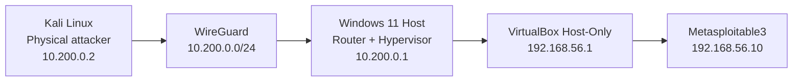

# Current Topology



## Return Path

```text
Metasploitable3 192.168.56.10
        │
        └─ route 10.200.0.0/24 via 192.168.56.1
                       │
                 Windows router
                       │
                   WireGuard
                       │
                  Kali 10.200.0.2
```
