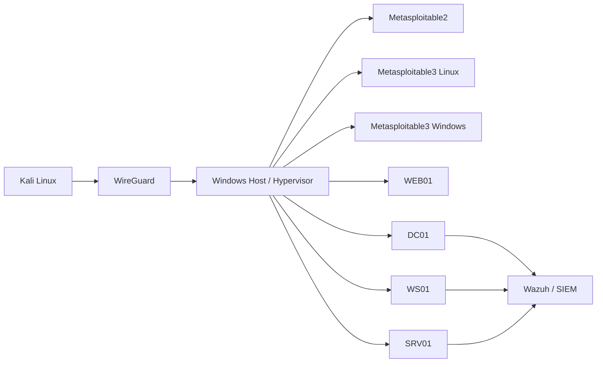

# Planned Future Topology

```mermaid
flowchart LR
    K["Kali Linux"]
    WG["WireGuard"]
    H["Windows Host / Hypervisor"]

    M2["Metasploitable2"]
    M3L["Metasploitable3 Linux"]
    M3W["Metasploitable3 Windows"]
    WEB["WEB01"]
    DC["DC01"]
    WS["WS01"]
    SRV["SRV01"]
    SOC["Wazuh / SIEM"]

    K --> WG --> H
    H --> M2
    H --> M3L
    H --> M3W
    H --> WEB
    H --> DC
    H --> WS
    H --> SRV

    DC --> SOC
    WS --> SOC
    SRV --> SOC
```

The goal is to reuse the same environment for both offensive testing and defensive visibility instead of maintaining completely separate learning labs.
