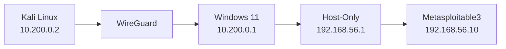

# Architecture

## Objective

The lab was designed to provide an isolated, reproducible environment for cybersecurity practice while keeping intentionally vulnerable systems away from the normal home LAN.

## Current Components

| Component | Role |
|---|---|
| Kali Linux | Physical attacker workstation |
| Windows 11 | Virtualization host and router between lab networks |
| WireGuard | VPN between Kali and the Windows host |
| VirtualBox | Hypervisor for vulnerable targets |
| Host-Only Adapter | Isolated target segment |
| Metasploitable3 | Current intentionally vulnerable target |

## Traffic Flow



The Windows host is the routing point between two distinct networks:

```text
10.200.0.0/24     WireGuard segment
192.168.56.0/24   VirtualBox lab segment
```

## Isolation Model

Preferred:

```text
Normal network
     │
Kali / Windows
     │
WireGuard + controlled routing
     │
VirtualBox Host-Only
     │
Vulnerable VM
```

Avoid:

```text
Home router
     │
Bridged Adapter
     │
Intentionally vulnerable VM
```

The target VM does not need to be directly reachable from the normal LAN to support the lab's objectives.
